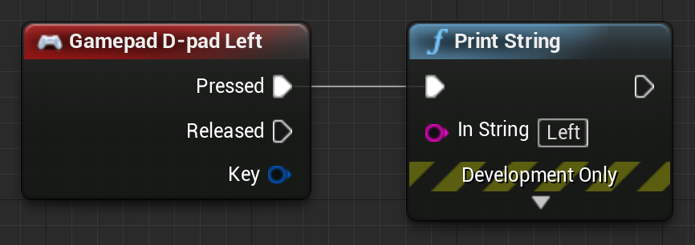
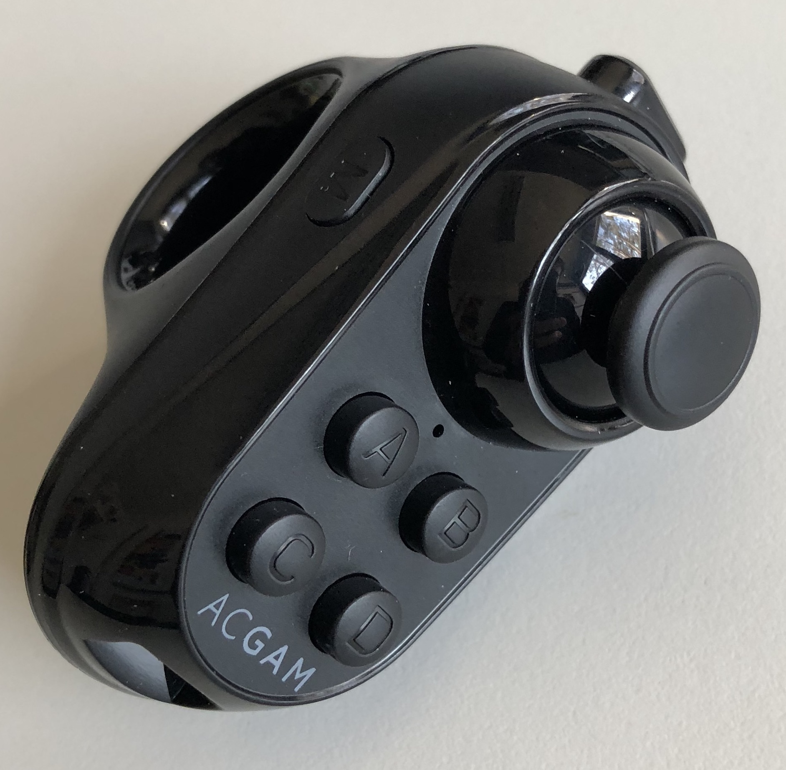
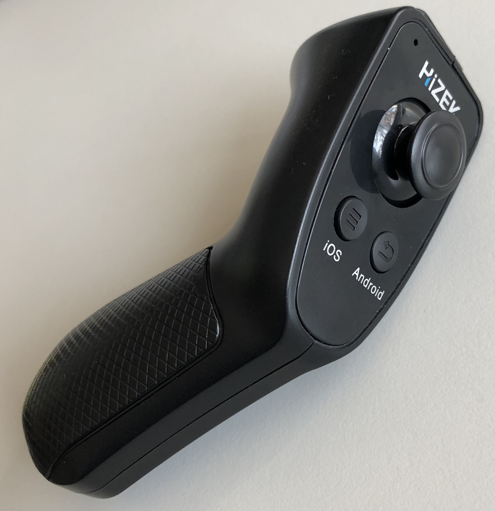

# Bluetooth Controller Support for UE4 GoogleVR iOS Apps

Unreal Engine 4 (UE4) plugin to enable usage of bluetooth remote controllers / gamepads / joysticks in iOS virtual reality (VR) apps.

## Getting Started

### Installation

1. Create a new C++ project or convert an existing project into a code project
2. Create a folder `Plugins` in the root of the project and copy the `BTC` plugin into this folder
3. Open the project in the UE4 editor
4. Activate the `GoogleVR` plugin (*Edit* &rarr; *Plugins* &rarr; *Virtual Reality* &rarr; *Google VR*)
5. Verify that the `BTC` plugin is activated (*Edit* &rarr; *Plugins* &rarr; *Project* &rarr; *VR Input Devices* &rarr; *BTC*)
6. Click *File* &rarr; *Refresh Xcode project*

Final file structure:
```
GameProjectName
+-- ...
+-- Content
+-- Plugins
    +-- BTC
        +-- BTC.plugin
        +-- LICENSE
        +-- README.md
        +-- Resources
        +-- Source
+-- ...
+-- GameProjectName.xcworkspace
```

### Usage

In Blueprints, for example:



Default mapping of controller buttons to UE4 events

| UE4 event | Generic<br/>controller | ACGAM R1 | VR SHINECON /<br/> HIZEK |
|---|---|---|---|
| Gamepad<br/> D-pad Left | Left | - | Joystick<br/> Left |
| Gamepad<br/> D-pad Right | Right | - | Joystick<br/> Right |
| Gamepad<br/> D-pad Up | Up | - | Joystick<br/> Up |
| Gamepad<br/> D-pad Down | Down | - | Joystick<br/> Down |
| Gamepad Right<br/> Shoulder | Enter | - | OK |
| Gamepad Face<br/> Button Left | Mute | A | - |
| Gamepad Face<br/> Button Right | Play / Pause<br/>Toggle | B | - |
| Gamepad Face<br/> Button Top | Volume Down | C | - |
| Gamepad Face<br/> Button Down | Volume Up | D | - |

### Configuration

1. Open the source code in Xcode (file `GameProjectName.xcworkspace`)
2. Go to the file `Game/GameProjectName/Plugins/BTC/Source/BTC/Private/BTCConfiguration.h`
3. Use the preprocessor macros `USE_ENTER_BUTTON`, `USE_ARROW_BUTTONS`, and `USE_SOUND_BUTTONS` to define which controller buttons should be re-mapped
4. Use the constants in the `BTCEventMapping` namespace to define which controller buttons are mapped to which UE4 events (i.e. to modify above table)

Important: If your controller does not implement the Bluetooth HID profile (e.g., ACGAM R1), remove `USE_ENTER_BUTTON` because otherwise the virtual keyboard will appear in VR mode.

## Tested Software Versions

* iPhone 8
* iOS 11.2.2
* UE 4.18.3

## Tested Bluetooth Remote Controllers

ACGAM R1
   * Supported buttons: A, B, C, D
   * Controller has to be in "music mode", which can be activated by pressing M-A



VR SHINECON / HIZEK
   * Supported buttons: Enter, Left, Right, Up, Down
   * Controller has to be in "VR mode"



## Implementation

The implementation does - very likely - not conform to iOS and UE4 programming guidelines, but - to the best of my knowledge - it is the only way to get such bluetooth controllers working.

The plugin adds an additional iOS `UIViewController` on top of UE4's main `UIViewController`. This additional controller...
* contains a hidden `UITextField` and implements the `UITextFieldDelegate` to capture the Enter button,
* contains a hidden `MPVolumeView` to capture the Volume Up, Volume Down, and Mute buttons,
* adds an observer to the `togglePlayPauseCommand` of the `MPRemoteCommandCenter`.

If any of these modifications affect other UE4 features, use the preprocessor macros `USE_ENTER_BUTTON`, `USE_ARROW_BUTTONS`, and `USE_SOUND_BUTTONS` to deactivate the corresponding modifications.

## License

Copyright 2018 Matthias Ring <br/>
Machine Learning and Data Analytics Lab <br/>
Friedrich-Alexander-University Erlangen-Nuremberg

Licensed under the Apache License, Version 2.0 (the "License"); you may not use this file except in compliance with the License.
You may obtain a copy of the License at

    http://www.apache.org/licenses/LICENSE-2.0

Unless required by applicable law or agreed to in writing, software distributed under the License is distributed on an "AS IS" BASIS, WITHOUT WARRANTIES OR CONDITIONS OF ANY KIND, either express or implied. See the License for the specific language governing permissions and limitations under the License.
